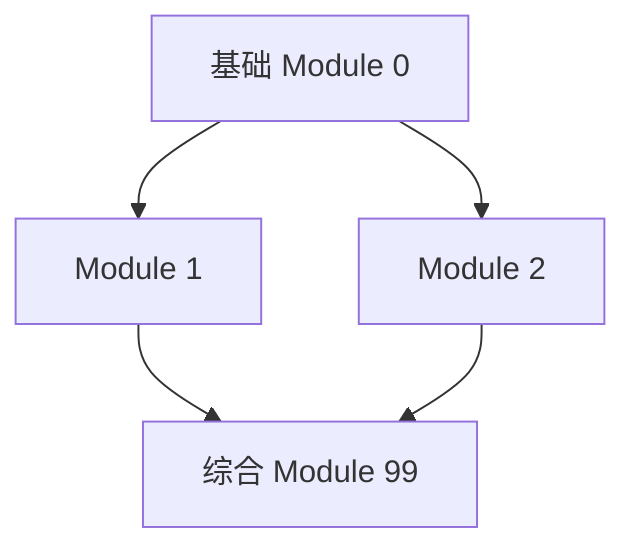

# Overview File Template (`00_总览.md`)

This is the **index page** of the entire notebook. The user opens it first.
It should let them:

1. Jump to any main note in one click
2. See the exam-relevance map at a glance
3. Understand the suggested study order
4. See the formula cheat-sheet for the whole course in one place

---

## Structure

```markdown
# <Course Name> 复习总览

> [!info] 来源
> 根据 `<review-pdf>` 整理的 N 大考试模块 + 基础课。
> 笔记体系包含 M 份主笔记 + K 份例题文件，全部 Obsidian 双向链接。

---

## 📚 N 大考试模块

| # | 模块 | 主笔记 | 例题文件 | 重点公式 |
|---|------|--------|----------|---------|
| 1 | <Module 1 Name> | [[01_xxx]] | [[例题与考点/01_xxx_例题与考点]] | $key formula$ |
| 2 | ... | ... | ... | ... |
| 综合 | 模拟卷 | — | [[例题与考点/99_综合模拟卷]] | N 题 |

---

## 🎯 考试准备建议

| 类型 | 准备方法 |
|------|----------|
| Calculations | 不看笔记练公式推导 |
| Conceptual | 精准术语 + 理论与实践挂钩 |
| Applied | 按子问题分块，验数值一致 |
| Time | ~1 min/分；每题都尝试 |

---

## 🔑 必背清单（Must-Know）

### Module 1 ⭐⭐⭐
- 概念 1
- 公式 1
- ...

### Module 2 ⭐⭐⭐
...

---

## 📝 学习路径建议



**优先级排序**（按考试占分预估）：
1. ...
2. ...

---

## 📎 附件

所有图片：`<vault-root>/附件/图片/<course>/`
- `subdir1/` N 张 — ...
- `subdir2/` M 张 — ...

---

## 🔗 反向链接
打开任意主笔记可通过 Obsidian backlinks 跳回本总览。
```

---

## Order of work

Write the overview **LAST**, not first.
- Reason: you need to know exactly what main notes exist, what topics
  they cover, and where formulas / images landed.
- The overview file should reflect reality, not aspiration.

## Length

Aim for 100–200 lines. Comprehensive but skimmable. If the table of
modules is the only thing the user looks at, the rest is bonus.
